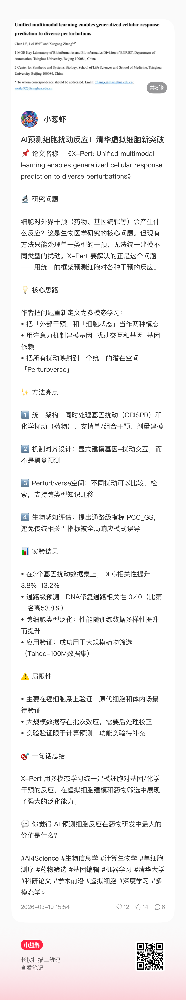

# OpenClaw 论文到小红书自动化流程

本仓库沉淀了一个可复用的内容自动化流水线：从论文解析，到标准化卡片，再到小红书文案生成与平台运营执行。

流程顺序固定为：`paper-parse -> paper-card-analyzer -> xhs-post-factory -> xiaohongshu-operate`。

## 1. 流程概览

### 1.1 `paper-parse`（论文自动解析）
- 作用：将学术 PDF 解析为结构化文本与图像资产。
- 能力重点：同时解析文字与图片。
- 典型输出：
  - `{paper_name}_content.md`：论文全文 Markdown。
  - `{paper_name}_parsed.json`：结构化元数据（标题、页数、图表信息等）。
  - `cover_title_authors.png`：首页标题与作者区域截图。
  - `figures/figure_*.png`：高分辨率论文图像提取结果。

这一步构建了后续全部环节的“事实依据层”（文本证据 + 图像证据）。

### 1.2 `paper-card-analyzer`（Paper Card 标准化）
- 作用：读取 `paper-parse` 产物，生成研究导向的标准 Paper Card。
- 固定输出：
  - `paper-card.md`
  - `paper-card.json`
  - `paper-card-feedback.md`
- 标准 section 顺序（固定 10 段）：
  1. Paper Snapshot
  2. Research Problem and Motivation
  3. Core Contributions
  4. Method Overview
  5. Experimental Setup
  6. Main Results and Evidence
  7. Ablation and Analysis Findings
  8. Limitations and Threats to Validity
  9. Reproducibility Notes
  10. Open Questions and Future Work

该标准格式的价值是“跨平台分发友好”：后续不论投放小红书、公众号、X/Twitter、LinkedIn 或知识库系统，都可直接复用统一结构并做模板映射。

### 1.3 `xhs-post-factory`（小红书推文生成）
- 作用：将 `pdf/md/txt/json` 等输入，转换为结构化小红书文案（v1 默认论文解读模板）。
- 默认输出：
  - `xhs-post.md`
  - `xhs-post.json`
- 模板路由：
  - 用户显式指定 `post_type` 时优先使用指定模板。
  - 未指定时按输入意图关键词匹配。
  - v1 默认 `paper-interpretation`。
- 可配置参数（已支持）：
  - `length`: `short` / `medium` / `long`
  - `emoji_density`: `low` / `medium` / `high`
- 可靠性约束：
  - 不虚构指标/数据集/结论。
  - 证据不足必须标注“原文未明确给出”。
  - `evidence_notes` 记录每段依据来源。

这一步可以按不同目标受众与内容策略，切换文案长度、语气密度和模板，实现“同源内容多版本发布”。

### 1.4 `xiaohongshu-operate`（小红书自动运营执行）
- 作用：按给定素材执行平台动作，核心是“运营执行”而不是“内容再生成”。
- 多模块能力（本 skill 核心特点）：
  - 发布模块：图文 / 长文 / 视频发帖，默认保存草稿。
  - 互动模块：评论检查、候选回复、确认后发送。
  - 搜索模块：关键词抓取 Top N 帖子并输出标准字段。
- 风险与降级：
  - 页面异常、频控提示、素材缺口时停止高风险动作并回传可继续状态。
  - 对评论/私信使用 persona 约束，避免越界表达。

## 2. 端到端数据流

```text
PDF
  -> paper-parse
     -> *_content.md + *_parsed.json + figures/*
  -> paper-card-analyzer
     -> paper-card.md + paper-card.json + paper-card-feedback.md
  -> xhs-post-factory
     -> xhs-post.md + xhs-post.json
  -> xiaohongshu-operate
     -> 平台草稿 / 评论处理记录 / 搜索抓取结果
```

输入输出衔接规则：
- `xhs-post-factory` 会优先复用同目录 `paper-card.*` 与 `paper-parse` 产物。
- `xiaohongshu-operate` 优先消费已定稿素材，不做事实重写。

## 3. 快速开始

### 3.1 目录说明
- `paper-parse/`：论文解析（文本 + 图像抽取）
- `paper-card-analyzer/`：标准 Paper Card 生成
- `xhs-post-factory/`：小红书文案工厂
- `xiaohongshu-operate/`：小红书运营执行

### 3.2 最小执行顺序
1. 先解析论文（建议先产出 `*_content.md` + `*_parsed.json` + `figures/`）。
2. 生成 Paper Card（`paper-card.md/json`）。
3. 生成小红书文案（`xhs-post.md/json`）。
4. 在平台执行发帖草稿、评论互动或搜索抓取。

### 3.3 典型命令（解析环节）
```bash
uv run paper-parse/scripts/parse_paper.py --pdf /path/to/paper.pdf --output-dir ./parsed
```

## 4. ClawHub 安装与使用案例

### 4.1 ClawHub 安装（四个 skill）
```bash
clawhub install paper-parse-figures
clawhub install paper-card-analyzer
clawhub install xhs-post-factory
clawhub install xiaohongshu-operate
```

### 4.2 使用 Prompt 案例

`"/papers/X-Pert/X-Pert_manuscript.pdf有篇论文，你帮我解析一下，然后转成paper card，生成对应的小红书博文，再帮我发表到小红书平台"`



## 5. 设计原则与可扩展性

本流程具有高度扩展性，可迁移到“各种内容 × 各种社交平台”的自动总结与自动运营：

- 内容侧扩展：
  - 从论文扩展到报告、行业白皮书、课程讲义、会议记录、播客转录等。
- 模板侧扩展：
  - 在 `xhs-post-factory/templates/` 新增模板即可支持新的文案类型。
- 平台侧扩展：
  - 将 `xiaohongshu-operate` 抽象为平台运营接口后，可新增微信公众号、B 站、X/Twitter、LinkedIn 等执行器。
- 工作流侧扩展：
  - 将 `paper-card` 作为中间标准层，可向检索系统、知识库、内容 CMS、A/B 发布系统对接。

## 6. 可靠性与治理建议

- 全链路坚持“证据驱动”：所有结论可追溯到解析文本或结构化字段。
- 明确区分“作者结论”与“运营解读”。
- 对缺失信息显式标注，不做隐式补写。
- 平台操作默认草稿优先，减少误发风险。

---

如需将该流程产品化，建议优先补齐：任务编排（scheduler）、日志追踪（observability）、多账号权限与审计、失败重试策略。

## 7. 示例：X-Pert 论文解读（作者本人）

下面这条小红书解读内容，来自我自己的论文 **X-Pert**（*Unified multimodal learning enables generalized cellular response prediction to diverse perturbations*）在本流程中的生成示例。欢迎大家阅读了解，也欢迎交流反馈。


